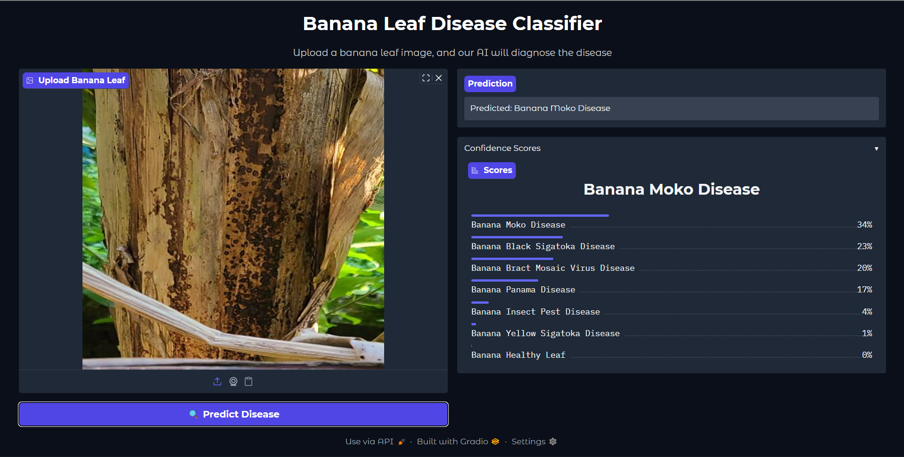

# 🍌 Banana Disease Classificator

This project is a **Banana Leaf Disease Classification System** that predicts banana plant health and disease categories using **Deep Learning**.  
It provides a **Gradio interface** where users can upload banana leaf images, and the model will classify them into one of **8 classes** with confidence scores.

---

## 🦠 Disease Classes
The model can classify banana leaves into the following categories:

1. Banana Black Sigatoka Disease  
2. Banana Bract Mosaic Virus Disease  
3. Banana Healthy Leaf  
4. Banana Insect Pest Disease  
5. Banana Moko Disease  
6. Banana Panama Disease  
7. Banana Yellow Sigatoka Disease

---

## 📂 Repository Contents
- `banana_dataset/` → Banana leaf dataset (images categorized into 8 classes)  
- `app.py` → Gradio file for user interface (image upload + prediction)  
- `banana_disease.py` → Model training script  
- `banana_disease_densenet121.keras` → Pre-trained DenseNet121 model (available on Hugging Face)  

---

## ⚡ How It Works
1. Upload a banana leaf image through the **Gradio app**.  
2. The trained DenseNet121 model processes the image.  
3. The system predicts the **disease class** and displays the **confidence score**.  

---

## 🛠️ Setup & Installation

### 1. Clone Repository

```bash
git clone https://github.com/your-username/banana-disease-classificator.git
cd banana-disease-classificator
```

### 2. Install Dependencies

```bash
pip install -r requirements.txt
```

### 3. Training the Model

- If you want to train the model from yourself run the file:

```bash
python banana_disease.py
```

### 4. Run Gradio App

```bash
python app.py
```
- the app running on http://127.0.0.1:7860/

## 📥 Pre-trained Model

If you don’t want to train the model from yourself, you can directly download the pre-trained model from my Hugging Face id:

- https://huggingface.co/Aaditya456/Banana-Disease-Classification/blob/main/banana_disease_densenet121.keras

After downloading the model place the model in the same repository.

## Example Prediction (Gradio UI)

**Banana Leaf Disease Classifier**

Upload a banana leaf image, and our AI model will diagnose the disease.



